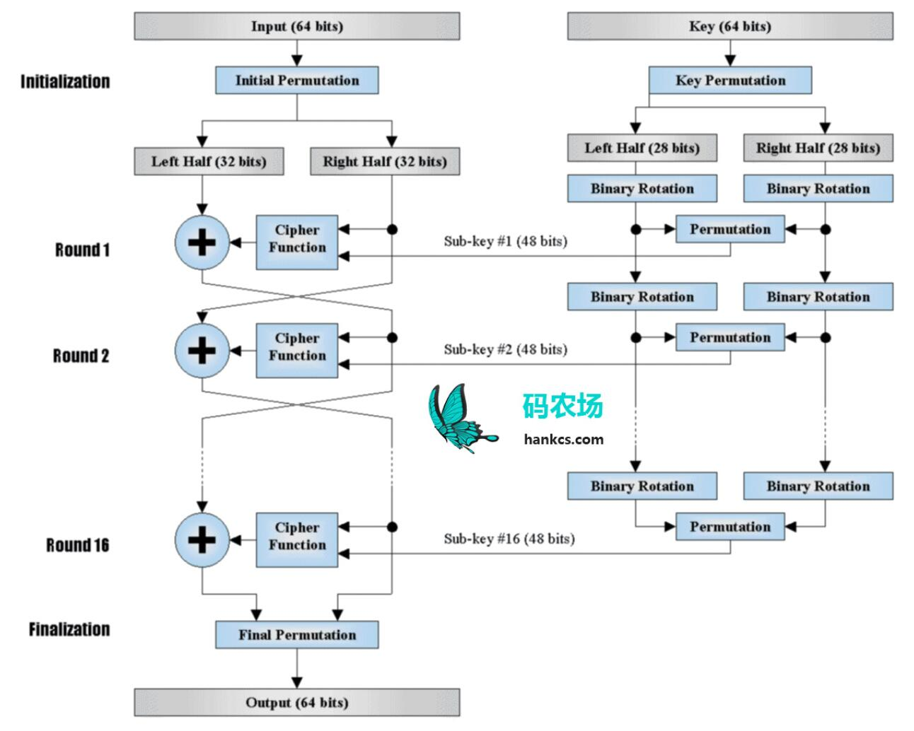
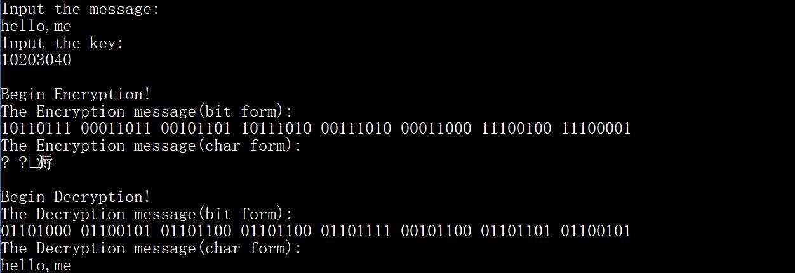

# DES 算法

[TOC]

## 算法原理概述

> DES 的算法原理基本概括在下图中。



DES 是一个基于组块的加密算法，这也即意味着输入和输出都将会是 64 位长度的。

观察上图，可知对于 Input (64 bits)，我们给 DES 算法给定一个 Key (64 bits)，则 DES 算法就能加密给出 Input 对应的密文 Output (64 bits)。

在 Initialization 阶段，我们需要：
* 对 Input (64 bits) 按照 IP_Table 进行 Initial Permutation 并将 64 bits 的结果分为左右各 32 bits，分别记为 $L_0$ (32 bits) 和 $R_0$ (32 bits)。
* 对 Key (64 bits) 按照 PC1_Table 进行 Key Permutation 并将 56 bits 的结果分为左右各 28 bits，分别记为 $C_0$ (28 bits) 和 $D_0$ (28 bits)。

在 Round n (n=1, 2, 3, ..., 16) 阶段，我们：

* 在 Key 一侧（右侧）：
  * 对 $C_{n-1}$ (28 bits) 和 $D_{n-1}$ (28 bits) 按照 LeftShiftTable 给出的第 1 轮的左移数来进行左移得到 $C_{n}$ (28 bits) 和 $D_{n}$ (28 bits)。
  * 将 $C_{n}$ 和 $D_{n}$ 拼合，记为 $C_{n}D_{n}$ (56 bits)
  * 对 $C_{n}D_{n}$ 按照 PC2_Table 进行 Permutation，得到 $Sub-key \#n$ (48 bits)

* 在 Input 一侧（左侧）：

  * $L_{n} = R_{n-1}$，其中 $R_{n-1}$ (32 bits)，$L_n$ (32 bits)

  * $R_{n} = L_{n-1} \oplus f(R_{n-1}, {Sub-Key} \#n)$，其中 $R_n$ (32 bits)，$L_{n-1}$ (32 bits)，下面重点描述 $f$ 函数

    * 首先 $R_{n-1}$ 和 $Sub-Key\#n$ 位数不同，需要先对 $R_{n-1}$ 按照 E_Table 进行扩展得到

       $E(R_{n-1})$ (48 bits)。

    * 将 $E(R_{n-1})$ 和 $Sub-Key\#n$ 异或，得到结果记为 $E\oplus SK$ (48 bits)

    * 按照 S_Box 将 $E \oplus SK$ 的每 6 bits 映射为 4 bits，得到结果记为 $S(E\oplus SK)$ (32 bits)

    * 对 $S(E \oplus  SK)$ 按照 P_Table 进行 Permutation，得到结果记为 $P(S(E\oplus SK))$ (32 bits)，该结果即为 $f(R_{n-1},Sub-Key)\#n$ 的结果，其位数与 $L_{n-1}$ 相等，可以进行异或运算。

在 Finalization 阶段，我们能够从之前的 Round 16 阶段获得 $L_{16}$ 和 $R_{16}$， 将其拼合为 $R_{16}L_{16}$，按照 IPR_Table 对其进行最终的 Inverse Initial Permutation，所得结果即为 Output。

解密就是加密的反过程，基本同样执行上述步骤，只不过在 Round 1~16 中，调转左右子秘钥的位置而已。

## 总体结构

> DES 算法的总体结构在算法原理概述中已经详细讲述，下面给出程序的总体结构

* `tables.h`：

  包含在算法原理概述中提到的：

  * `IP_Table`
  * `PC1_Table`
  * `PC2_Table`
  * `LeftShiftTable`
  * `E_Table`
  * `S_Box`
  * `P_Table`
  * `IPR_Table`

* `des.c`：

  程序的主体，以及以下一系列函数：

  * `char2bit`：将 char 转换为 bit（根据 ASCII）
  * `bit2char`：将 bit 转换为 char（根据 ASCII）
  * `IP`：Initial Permutation（初始变换）
  * `PC_1`：Key (64 bits) $\rightarrow$ Key (56 bits)
  * `LeftShift`：左移函数
  * `PC_2`：Key (56 bits) $\rightarrow$ $Sub-Key\#n$ (48 bits)
  * `getSubKeys`：获得 16 个子秘钥
  * `E`：E 扩展
  * `Xor`：执行异或运算
  * `S`：S_Box 变换
  * `P`：P 变换
  * `F`：对应于 $f$ 函数
  * `IPR`：逆初始变换
  * `DES_E`：加密 DES 算法
  * `DES_D`：解密 DES 算法

## 模块分解

程序主要可分为分为如下模块：

* 类型转换模块：完成字符 char 和二进制之间的转换。
* 加密模块：完成 DES 的加密
* 解密模块：完成 DES 的解密

可以继续改进的地方：

* 添加输入处理模块：**程序在输入上几乎没有做任何处理，而是强制的要求用户输入的要加密的信息和密钥必须都是 8 bytes 也即 64 bits 以内**，一旦超过就会报错。显然，现实生活中，存在大量的信息需要进行加密，这也即意味着有必要在输入上做处理：
  * 分割：将大的输入分割为小的输入，小的输入不大于 64 bits，不够 64 bits 的部分简单的用 0 补齐
  * 错误输入检测：对于非法的输入，程序能够检测到并提醒用户

## 数据结构

>  程序基本上没有使用数组以外的数据结构。

本次实验中，我们大规模地使用一维、二维以及三维数组进行编程。

比如：

```c
// des.c line 207 ~ 212
	char msg[9] = {};
	char key[9] = {};
	int EmsgInBit[64] = {};
	char EmsgInChar[9] = {};
	int DmsgInBit[64] = {};
	char DmsgInChar[9] = {};

// des.c line 54 ~ 55

	int LeftShiftC[16][28] = {};
	int LeftShiftD[16][28] = {};

// tables.h line 72
int S_Box[8][4][16] = {
	// S1 	
	14,  4, 13,  1,  2, 15, 11,  8,  3, 10,  6, 12,  5,  9,  0,  7,
	 0, 15,  7,  4, 14,  2, 13,  1, 10,  6, 12, 11,  9,  5,  3,  8,
	 4,  1, 14,  8, 13,  6,  2, 11, 15, 12,  9,  7,  3, 10,  5,  0,
	15, 12,  8,  2,  4,  9,  1,  7,  5, 11,  3, 14, 10,  0,  6, 13,
    ...
}
```

## C 语言源代码

>  已和本文档一同打包发送，也可见我的 [Github]()

## 编译运行结果

> 在 VS 2017 下运行结果如图



图中密文的 char form 部分为乱码，但属于正常情况，加密过程是在二进制上实现的，也即最后得到的是 bit form 的密文。图中的密文 char form 的乱码是自定义的 bit 到 char 转换函数处理 bit form 的密文后的结果。

## 参考博客

[DES 算法实例详解-码农场](http://www.hankcs.com/security/des-algorithm-illustrated.html)：推荐一看，该博客没有给出 DES 算法的代码实现，但清晰地讲述了流程和原理。


